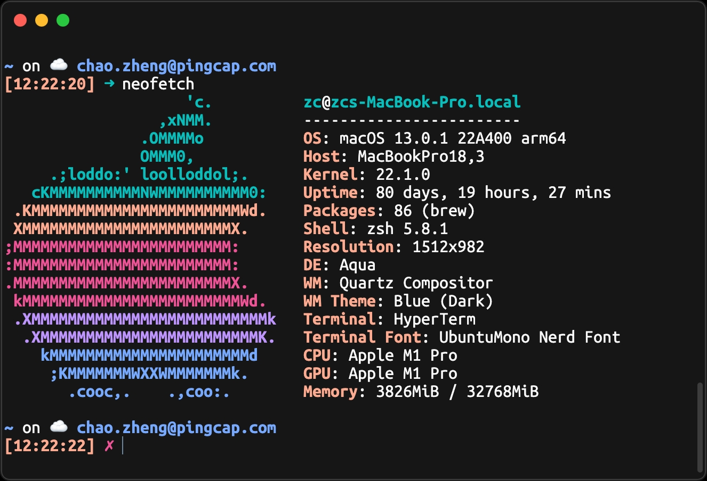

# Hyper Oxocarbon 

Dark [Hyper](https://hyper.is) theme based on the [oxocarbon.nvim](https://github.com/nyoom-engineering/oxocarbon.nvim) color palette.



### Install

1. Open Hyper's preferences with `Cmd + ,` (or manually at `~/.hyper.js`) with your editor.
2. Update your list of plugins to include `hyper-oxocarbon`, like so:

  ```js
plugins: [
    'hyper-oxocarbon'
],
```
3. Fully reload Hyper (`Cmd+Shift+R`).

### License

MIT
